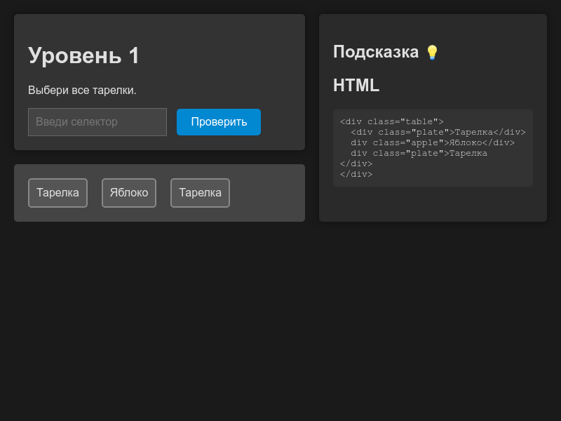

# CSS Уроки: Русификация CSS Diner

  

## Описание проекта

Этот проект — русифицированная версия популярной обучающей игры [CSS Diner](https://flukeout.github.io/), созданной для изучения CSS-селекторов. Игра переведена на русский язык, адаптирована для русскоязычных пользователей и дополнена современным интерфейсом. Проект включает 30 уровней, которые помогут вам освоить CSS-селекторы от базовых до продвинутых.

### Основные особенности

- **30 уровней сложности**: от простых селекторов (например, `.class`, `:first-child`) до сложных комбинаций (`:not()`, `:nth-child()`, `~`).
- **Тёмная тема**: стильный интерфейс с тёмным фоном и контрастными элементами.
- **Интерактивные подсказки**: подсказки скрыты по умолчанию и отображаются только после нажатия на кнопку с лампочкой (`💡`), чтобы стимулировать самостоятельное решение.
- **Отображение HTML-кода**: в правой колонке показывается HTML-код элементов на "столе", что помогает понять структуру DOM.
- **Усложнённые подсказки**: подсказки не содержат прямых ответов, а направляют пользователя к самостоятельному решению.

## Установка и запуск 
### Локальный запуск 

1. Склонируйте репозиторий на свой компьютер:
2. ```bash git clone https://github.com/your-username/css-lessons.git ```
3. Замените `your-username` на ваше имя пользователя на GitHub.
4. Перейдите в каталог проекта: ```bash cd css-lessons ```
5. Откройте файл index.html в браузере: - **Windows**: дважды щёлкните по файлу `index.html`. - **macOS/Linux**: выполните команду, например: ```bash open index.html ```

### Развёртывание на страницах GitHub 

1. Убедитесь, что структура проекта корректна: ``` css-lessons/ ├── index.html ├── css/ │   └── style.css ├── js/ │   └── script.js └── README.md ```
2. Отправьте проект на GitHub (если это ещё не сделано): ```bash git add . git commit -m "Добавлены файлы проекта и README" git push -u origin main ```
3. Включите страницы GitHub: - Перейдите в раздел **Настройки → Страницы** в вашей репозитории. - В разделе «Сборка и развертывание» выберите «Источник» → «Развернуть из ветки». - Укажите ветку `main` и корневую директорию `/ (root)`. - Нажмите **Сохранить**.
4. Через несколько минут сайт будет доступен по адресу: `https://your-username.github.io/css-lessons/`
   
## Использование 

1. Откройте сайт в браузере (локально или через GitHub Pages).
2. Введите подходящий CSS-селектор для выполнения задачи текущего уровня.
3. Нажмите кнопку «Проверить». Если селектор верный, элементы подсветятся, и появится кнопка «Дальше».
4. Используйте кнопку с лампочкой (`💡`) для отображения подсказок (по умолчанию она скрыта).
5. В правой колонке изучите элементы HTML-кода, чтобы понять их структуру.
   
### Пример уровня **Уровень 1**: 

«Выбери все тарелки». **Подсказка** (скрыта по умолчанию): «Попробуй выбрать элементы по их классу, например, класс тарелок.» **HTML-код**: 
```html <div class="table">   <div class="plate">Тарелка</div>   <div class="apple">Яблоко</div>   <div class="plate">Тарелка</div> </div> ``` 
**Правильный селектор**:  
`.plate` 

## Разработка

Проект создан с использованием HTML, CSS и JavaScript. 
Основные файлы: 
- `index.html`: Основная страница.
- `css/style.css`: стили для тёмной темы и оформления.
- `js/script.js`: логика игры, включая уровни, проверки селекторов и управление подсказками. 

### Добавление новых уровней Чтобы добавить новый уровень: 

1. Откройте файл `js/script.js`.
2. Добавьте новый объект в массив `levels`. Например: ```javascript {   task: "Выбери новый элемент.",   hint: "Подумай, как выбрать элемент по его классу.",   answer: ".new-class",   items: `<div class="new-class">Новый элемент</div>` } ```
3. Сохраните изменения и отправьте их на GitHub.

## Вдохновение 

Проект вдохновлён [CSS Diner](https://flukeout.github.io/) от Flukeout. Мы стремились сохранить обучающий дух оригинала, адаптировав его для русскоязычной аудитории и добавив современные улучшения. 

## Лицензия 

Проект распространяется под лицензией MIT. Вы можете использовать, изменять и распространять его по своему усмотрению. 

---
*Создано с ❤️ для изучения CSS.*
